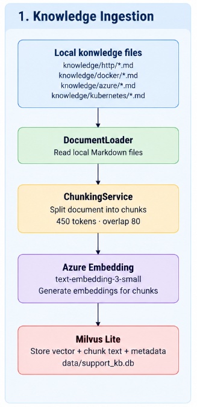

# AI Support Assistant

AI Support Assistant is a Streamlit-based chatbot that helps support teams analyze technical error screenshots and provide related troubleshooting solutions.

## How It Works

1. The user enters a technical error or uploads an error screenshot.
2. OpenCV and EasyOCR extract text from the screenshot.
3. Regex and rule-based logic extract useful error information without using an LLM.
4. The extracted error is converted into an embedding using Azure OpenAI.
5. Milvus Lite searches the local knowledge base for relevant document chunks.
6. GPT generates a troubleshooting response based only on the retrieved knowledge.
7. The answer and source citations are displayed in the Streamlit chat.

## Flow



## Tech Stack

- Python
- Streamlit
- OpenCV
- EasyOCR
- Azure OpenAI
- text-embedding-3-small
- gpt-6-luna
- Milvus Lite
- Tiktoken

## Knowledge Base

Sources include:

- MDN Web Docs – HTTP status codes  
  https://github.com/mdn/content/tree/main/files/en-us/web/http/reference/status

- Docker Official Documentation – Docker daemon troubleshooting  
  https://github.com/docker/docs

- Microsoft Azure Documentation – Azure RBAC troubleshooting  
  https://github.com/MicrosoftDocs/azure-docs


Local Markdown files are stored in:

```text
knowledge/
├── azure/
├── docker/
└── http/
```

Documents are processed using:

```text
Markdown
→ Chunking
→ Embedding
→ Milvus Lite
```

## Setup

Create a `.env` file:

```env
AZURE_OPENAI_API_KEY=your_api_key
AZURE_OPENAI_BASE_URL=your_azure_openai_base_url
AZURE_OPENAI_GENERATION_DEPLOYMENT=gpt-6-luna
AZURE_OPENAI_EMBEDDING_DEPLOYMENT=text-embedding-3-small
MILVUS_LITE_PATH=./data/support_kb.db
MILVUS_COLLECTION=support_knowledge
TOP_K=5
MIN_RETRIEVAL_SCORE=0.35
OCR_LANGS=en
OCR_USE_GPU=false
```

## Run

Activate the virtual environment:

```powershell
.\.venv\Scripts\Activate.ps1
```

Install dependencies:

```powershell
pip install -r requirements.txt
```

Ingest the knowledge base:

```powershell
python -m scripts.ingest_data
```

Run the chatbot:

```powershell
python -m streamlit run app.py
```

Open:

```text
http://localhost:8501
```

## Scope

The chatbot only handles technical software and system errors. Non-error questions are rejected.

Information extraction from screenshots is performed using OCR, regex, and rule-based logic without using an LLM.
